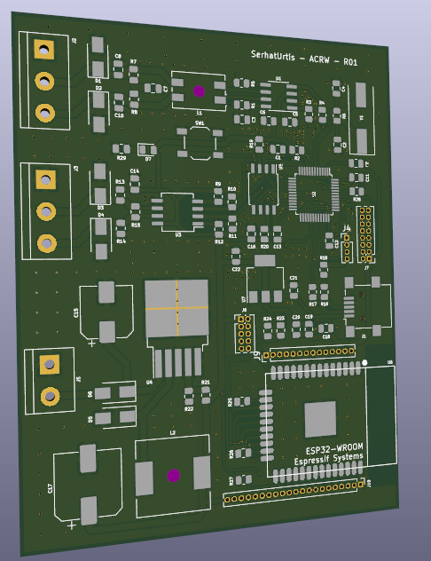

 

  

<h3 align="center">AUTOLOGGER</h3>

  

    A data logger board for automobile communications applications.
  

<!-- WHAT -->
## What?

This is a board for logging and controlling CAN & RS485 communications with an ESP32 module on board for remote connection.

## Why?

Because one of my friends asked me to.

## How?

...
